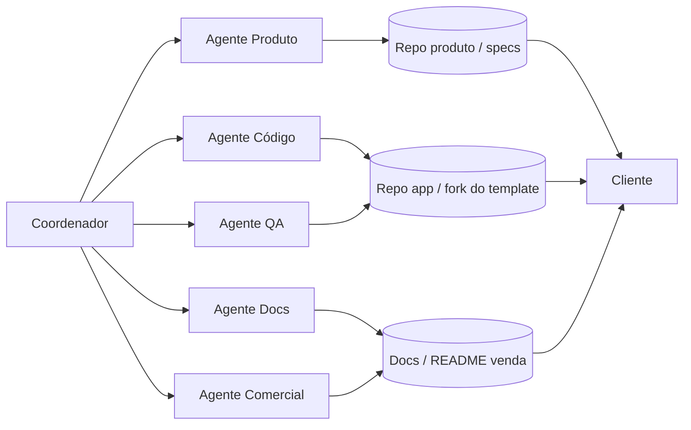
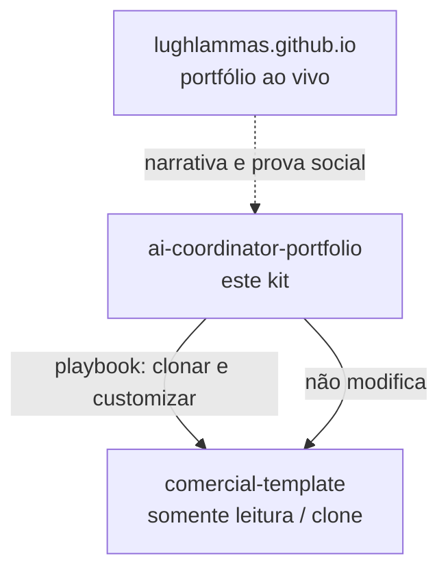

# Arquitetura de coordenação

Visão do fluxo: o **Coordenador** orquestra agentes especializados; cada um entrega em repositórios ou artefatos; o cliente recebe o produto e a oferta.

## Diagrama

## Camadas

| Camada | Responsável | Entrega típica |
|--------|-------------|----------------|
| Coordenação | Coordenador (humano ± IA) | Briefing, priorização, handoffs, aceite |
| Agentes | Produto, Código, QA, Docs, Comercial | Specs, código, testes, documentação, oferta |
| Repositórios | GitHub (forks/derivados, **nunca** o template canônico) | Código versionado, PRs, releases |
| Cliente | Stakeholder / comprador | Demo, README de venda, proposta |

## Relação com os outros ativos

- **Portfólio (github.io):** vitrine pública do coordenador.
- **comercial-template:** base de produto; clone ou use `--template`; **não editar o original**.
- **Este kit:** metodologia e prompts para repetir o processo com qualidade.

## Fluxo resumido

1. Coordenador recebe demanda → briefing (`prompts/briefing.md`).
2. Agente Produto estrutura escopo e critérios de aceite.
3. Código parte de um **fork/clone** do template comercial.
4. QA valida; Docs e Comercial fecham README de venda e oferta.
5. Coordenador entrega ao cliente e registra decisões relevantes.
